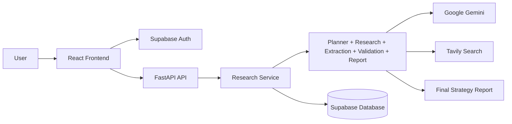

# McKinsey AI Market Research Strategy Engine

AI-powered market research and strategy platform that turns a user brief into a structured, evidence-backed report. The system combines a multi-agent research pipeline with a React frontend and a FastAPI backend to search the web, validate sources, synthesize insights, and deliver a report that is traceable to its supporting evidence.

## Overview

The application is designed for research teams, consultants, and strategy teams who need fast market intelligence without manually stitching together web research, evidence review, and reporting. A user submits a research brief with scope such as target market, geography, timeframe, and competitors. The platform processes that brief through a research pipeline and returns a report with findings, recommendations, and source-backed citations.

At a high level, the workflow is:

Planner → Research → Extraction → Validation → Citation Build → Report Generation → Report Linker

This gives the platform a clear chain from raw web evidence to final strategic output.

## Key Features

- Natural-language market research briefing
- AI-powered planning of research tasks
- Web search for public sources and credible market data
- Evidence extraction from retrieved sources
- Validation of relevance, credibility, duplication, and conflict
- Source-aware citation and report linkage
- Structured strategy report generation
- User-scoped research job history
- Supabase-powered authentication and persistence
- Modern React interface for submission and review

## Architecture

The system is composed of a React frontend, a FastAPI backend, and an AI-powered research pipeline that stores results in Supabase.



### Frontend

- React + Vite
- React Router
- Supabase JS client for auth and data access
- Tailwind-based styling
- Framer Motion and Lucide icons for interface polish

### Backend

- FastAPI
- Pydantic models and validation
- Supabase integration
- JWT-based user auth verification
- Repository pattern for job, source, evidence, validation, and report persistence

### AI Pipeline

- Google Gemini for planning, extraction, validation, and report generation
- Tavily for searching the web
- Multi-stage agent architecture for research quality and traceability

## Repository Structure

- backened/ — FastAPI backend, AI agent code, repositories, and database logic
- frontened/ — React frontend application
- project-docs/ — architecture and system documentation
- assets/ — project assets and supporting materials
- tests/ — resilience and retry testing for AI pipeline components

## Tech Stack

- Frontend: React, Vite, Tailwind CSS, React Router
- Backend: Python, FastAPI, Pydantic
- Database/Auth: Supabase
- AI: Google Gemini, Tavily
- Deployment: Vercel / static frontend, Python host for backend

## Prerequisites

Before running the project locally, make sure you have:

- Python 3.11+
- Node.js 18+
- npm
- A Supabase project
- A Google API key
- A Tavily API key

## Local Setup

### 1. Clone the repository

```bash
git clone <your-repository-url>
cd McKinsey-AI-Market-Research-Strategy-Engine-main
```

### 2. Backend setup

```bash
cd backened
python3 -m venv .venv
source .venv/bin/activate
pip install -r requirements.txt
cp .env.example .env
```

Update the backend `.env` file with your credentials:

```env
GOOGLE_API_KEY=your_google_api_key
TAVILY_API_KEY=your_tavily_api_key
SUPABASE_URL=https://your-project-ref.supabase.co
SUPABASE_KEY=your_service_role_key
```

Important:
- `SUPABASE_KEY` should be the service role key for backend use only.
- Never expose this key to the frontend.

Then start the API:

```bash
uvicorn backend.main:app --reload --port 8000
```

The backend will be available at:

```text
http://localhost:8000
```

### 3. Frontend setup

```bash
cd ../frontened
npm install
cp .env.example .env
```

Update the frontend `.env` file:

```env
VITE_SUPABASE_URL=https://your-project-ref.supabase.co
VITE_SUPABASE_ANON_KEY=your_supabase_anon_key
VITE_API_BASE_URL=http://localhost:8000
```

Then run the app:

```bash
npm run dev
```

Open the UI in your browser:

```text
http://localhost:5173
```

## Authentication

The app uses real Supabase Authentication. Users sign in via the frontend, and the backend verifies the incoming access token for protected research endpoints. Research jobs are associated with the authenticated user, so each user can access only their own jobs and reports.

## Research Workflow

When a user submits a brief, the backend creates a research job and runs the full AI pipeline. The system typically does the following:

1. Builds a structured research brief from the user input
2. Breaks the objective into smaller research tasks
3. Searches the web for relevant sources
4. Extracts evidence and claims
5. Validates evidence for credibility and duplication
6. Generates a structured report
7. Stores the job, sources, evidence, and output in Supabase

The result is a research report with traceable support behind its main conclusions.

## Important Notes

- The current research flow is synchronous: the API waits for the pipeline to complete before returning the result.
- Research jobs, sources, validation records, and final reports are persisted in Supabase.
- The frontend shows a loading experience while the backend processes the request.
- CORS must allow the frontend origin when running locally or in production.

## Deployment

### Frontend

Use any static hosting platform such as Vercel or Netlify. Make sure to set the frontend environment variables:

- `VITE_SUPABASE_URL`
- `VITE_SUPABASE_ANON_KEY`
- `VITE_API_BASE_URL`

### Backend

Deploy on a Python-capable host such as Render, Railway, Fly.io, or a VM. Configure the server environment with:

- `GOOGLE_API_KEY`
- `TAVILY_API_KEY`
- `SUPABASE_URL`
- `SUPABASE_KEY`

Then update the frontend's `VITE_API_BASE_URL` to point to the deployed backend URL.

## Development Notes

This project follows a clean separation between:
- orchestration and API handling
- AI agent logic
- repository/data access
- user-facing frontend
- Supabase-backed persistence

This makes it easier to extend the workflow with additional agents, data sources, or reporting formats.

## Summary

McKinsey AI Market Research Strategy Engine is a full-stack AI research platform built to accelerate market analysis and strategic decision-making. It combines modern web application architecture with agent-based research automation and structured reporting, giving users a practical way to turn a research brief into an evidence-based strategy deliverable.
