# McKinsey AI Market Research Engine

> **An AI-powered, evidence-driven market research platform that transforms a business question into a structured, validated, citation-backed strategy report.**


## Live App

- Open the application: [McKinsey AI Market Research Strategy App](https://mc-kinsey-ai-market-research-strate.vercel.app/login)

---

## 1. Project Overview

The **McKinsey AI Market Research Engine** is a full-stack AI research application designed to automate the major stages of market research.

Instead of manually searching many websites, collecting information, checking evidence, preparing citations, and writing a final report, the system organizes the complete workflow into a **7-stage research pipeline**.

### The core idea

```text
Business Question
       ↓
Research Planning
       ↓
Web Research
       ↓
Evidence Extraction
       ↓
Evidence Validation
       ↓
Citation Building
       ↓
AI Strategy Report
       ↓
Evidence / Source Traceability
```

The architecture separates **research planning, source discovery, evidence processing, validation, report generation, and traceability** so that the final report can be connected back to supporting research.

---

# 2. 30-Second Explanation for an Instructor

> **“This project is an AI-powered market research engine. A user enters a research question through the React frontend. The FastAPI backend sends the request through seven specialized stages: Planner, Research, Extraction, Validation, Citation Builder, Report Agent, and Report Linker. Tavily is used for web research, Google Gemini is used for AI reasoning and generation, and Supabase provides authentication and persistent storage. The final output is a structured strategy report with citations and links back to the underlying evidence and sources.”**

---

# 3. Architecture at a Glance

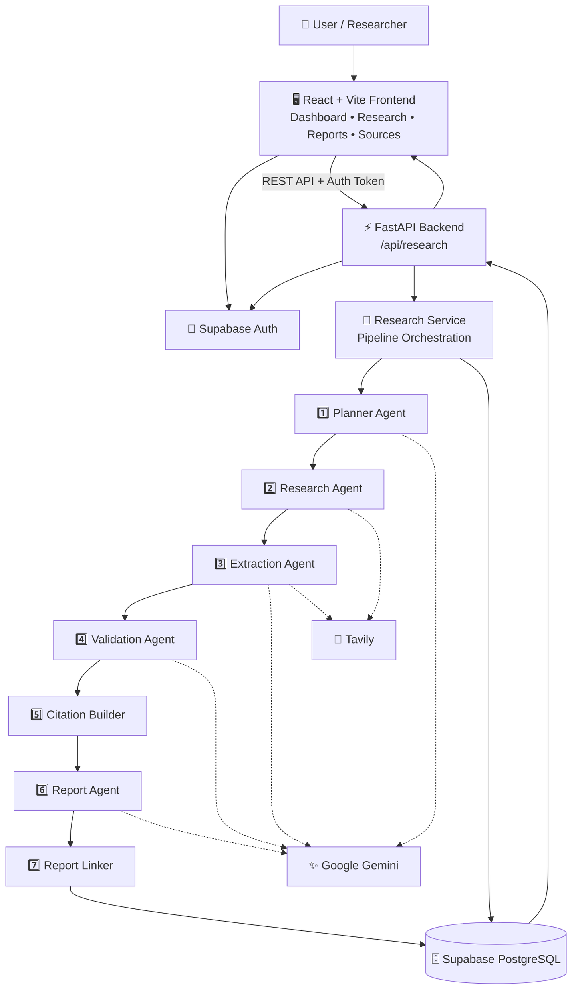

### Architecture in one line

**User → React → FastAPI → 7-Stage Research Pipeline → Gemini + Tavily → Supabase → Report + Evidence Traceability**

---

# 4. What Problem Does It Solve?

Traditional market research can require:

- Searching many web pages
- Reading and comparing sources
- Extracting useful facts
- Checking whether evidence supports claims
- Organizing research findings
- Building citations
- Writing a strategic report
- Connecting final conclusions to original sources

This project turns those activities into a structured software workflow.

### Traditional workflow

```text
Search
  ↓
Read
  ↓
Copy Notes
  ↓
Compare
  ↓
Validate
  ↓
Write
  ↓
Add Citations
```

### McKinsey AI Market Research Engine

```text
Research Question
       ↓
   AI Planner
       ↓
   Web Research
       ↓
Evidence Extraction
       ↓
Evidence Validation
       ↓
Citation Builder
       ↓
Strategy Report
       ↓
Source Traceability
```

---

# 5. Main Features

| Feature | Purpose |
|---|---|
| 🧠 AI Research Planning | Breaks a broad research question into structured research tasks |
| 🔎 Web Research | Finds relevant online information using Tavily |
| 📄 Evidence Extraction | Converts research content into usable evidence |
| ✅ Evidence Validation | Checks evidence before it contributes to the report |
| 🔗 Citation Building | Connects report claims with supporting sources |
| 📝 AI Report Generation | Produces a structured market/strategy report |
| 🧭 Report Linking | Preserves traceability from findings to evidence and sources |
| 🔐 Authentication | Uses Supabase Auth for user authentication |
| 🗄️ Persistent Storage | Stores research jobs, sources, evidence, validation, reports and feedback |
| 🛡️ Resilience | Includes retry/resilience tests for external AI and search services |
| 📊 Research Dashboard | Provides a frontend interface for creating and viewing research |

---

# 6. The 7-Stage AI Research Pipeline

The most important part of the project is the **7-stage research pipeline**.

```mermaid
flowchart LR
    Q["Research Question"]

    P["1. Planner<br/>Create research plan"]
    R["2. Research<br/>Find sources"]
    E["3. Extraction<br/>Extract evidence"]
    V["4. Validation<br/>Check evidence"]
    C["5. Citation Builder<br/>Build citations"]
    A["6. Report Agent<br/>Generate report"]
    L["7. Report Linker<br/>Link report to evidence"]

    OUT["Final Strategy Report<br/>+ Citations + Traceability"]

    Q --> P --> R --> E --> V --> C --> A --> L --> OUT
```

---

## Stage 1 — Planner Agent

### Responsibility

The Planner Agent converts the user's research question into a structured research plan.

### Input

```text
User's research question
```

### Processing

```text
Broad Question
      ↓
Identify research areas
      ↓
Break into tasks
      ↓
Create structured research plan
```

### Output

```text
Structured research tasks
```

### Why it matters

A broad question is easier to research when it is divided into smaller, focused tasks.

---

## Stage 2 — Research Agent

### Responsibility

The Research Agent searches the web for relevant information.

### Technology

**Tavily**

```text
Research Task
     ↓
Tavily Search
     ↓
Relevant Web Sources
     ↓
Source Collection
```

The goal is to collect source material that can be processed in later stages.

---

## Stage 3 — Extraction Agent

### Responsibility

The Extraction Agent processes collected source information and identifies useful evidence.

```text
Web Source
    ↓
Content
    ↓
Relevant Information
    ↓
Extracted Evidence
```

Google Gemini can be used for AI-assisted extraction and reasoning, while source/search information is supplied by the research stage.

---

## Stage 4 — Validation Agent

### Responsibility

The Validation Agent checks whether extracted evidence is suitable for use.

```text
Extracted Evidence
       ↓
Validation
       ↓
Supported / Usable Evidence
       ↓
Continue to Report Pipeline
```

This stage is important because the final report should not simply repeat every piece of information found during research.

---

## Stage 5 — Citation Builder

### Responsibility

The Citation Builder connects report-ready evidence to source information.

```text
Validated Evidence
       ↓
Source Information
       ↓
Citation
       ↓
Report-Ready Reference
```

This creates a stronger relationship between **what the report says** and **where the information came from**.

---

## Stage 6 — Report Agent

### Responsibility

The Report Agent synthesizes validated research into a structured strategy report.

```text
Validated Evidence
       +
Citations
       ↓
Report Agent
       ↓
Structured Strategy Report
```

Google Gemini is used for AI-powered report generation.

---

## Stage 7 — Report Linker

### Responsibility

The Report Linker preserves the connection between the final report and the underlying evidence/source records.

```text
Final Report
    ↓
Report Finding
    ↓
Evidence
    ↓
Source
    ↓
Original URL
```

This is the project's **traceability layer**.

---

# 7. End-to-End Request Flow

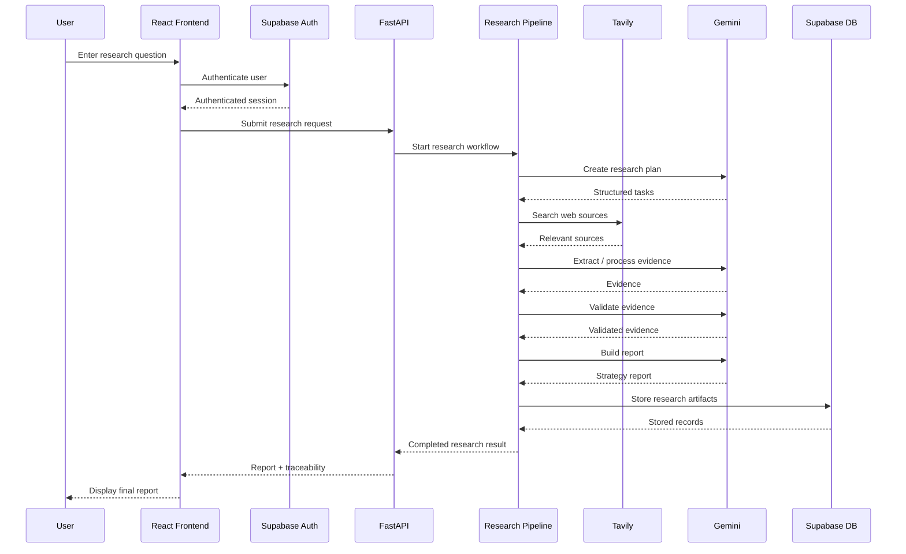

---

# 8. Complete Data Flow

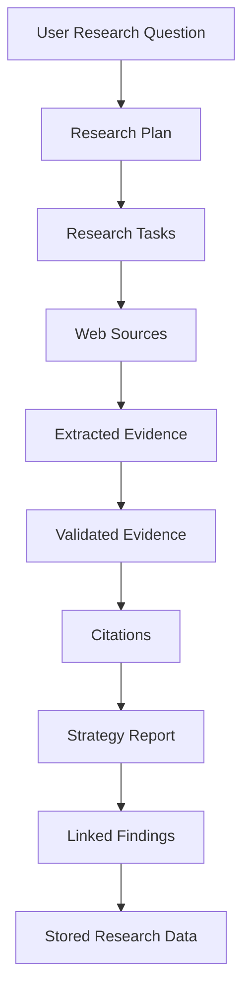

### Data transformation

| Step | Data Produced |
|---|---|
| User Input | Research question |
| Planner | Structured research plan |
| Research | Source records |
| Extraction | Evidence records |
| Validation | Validation records |
| Citation Builder | Citation information |
| Report Agent | Report content |
| Report Linker | Evidence/source links |
| Supabase | Persistent research artifacts |

---

# 9. Evidence-to-Citation Traceability

One of the strongest architectural ideas in the project is that the report is not treated as an isolated block of AI-generated text.

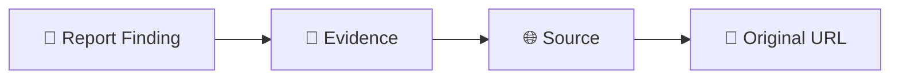

### Example concept

```text
Report Finding
      ↓
Evidence ID
      ↓
Source ID
      ↓
Source Title / Metadata
      ↓
Original URL
```

This makes it easier to explain:

> **“Where did this statement in the report come from?”**

---

# 10. System Components

## Frontend

The frontend provides the user-facing research experience.

### Main technologies

- React 19
- Vite
- React Router
- Tailwind CSS
- Framer Motion
- Supabase JavaScript client

### Responsibilities

```text
User Interface
     ↓
Authentication
     ↓
Research Request
     ↓
API Communication
     ↓
Report / Source Presentation
```

---

## Backend

The backend is built with FastAPI.

### Main technologies

- Python
- FastAPI
- Uvicorn
- Pydantic
- Supabase Python client
- Google GenAI
- Tavily

### Responsibilities

```text
API Request
    ↓
Authentication
    ↓
Research Service
    ↓
Pipeline Execution
    ↓
Database Persistence
    ↓
API Response
```

---

# 11. Technology Stack

```text
┌───────────────────────────────────────────────────────┐
│                    PRESENTATION                        │
│                                                       │
│  React 19 • Vite • Tailwind CSS • React Router       │
│  Framer Motion • Supabase JS                         │
└───────────────────────┬───────────────────────────────┘
                        │ REST API
                        ▼
┌───────────────────────────────────────────────────────┐
│                     BACKEND                           │
│                                                       │
│  FastAPI • Uvicorn • Pydantic • Python               │
│  Research Service • API Routes                        │
└───────────────────────┬───────────────────────────────┘
                        │
                        ▼
┌───────────────────────────────────────────────────────┐
│                 AI RESEARCH PIPELINE                  │
│                                                       │
│ Planner → Research → Extraction → Validation         │
│        → Citation → Report → Report Linker            │
└───────────────┬───────────────────────┬───────────────┘
                │                       │
                ▼                       ▼
        ┌──────────────┐        ┌──────────────┐
        │ Google Gemini│        │    Tavily    │
        │ AI reasoning │        │ Web research │
        └──────────────┘        └──────────────┘
                │                       │
                └───────────┬───────────┘
                            ▼
┌───────────────────────────────────────────────────────┐
│                    DATA LAYER                         │
│                                                       │
│              Supabase PostgreSQL                      │
│              + Supabase Auth                          │
└───────────────────────────────────────────────────────┘
```

---

# 12. Why These Technologies?

| Technology | Role in the Project |
|---|---|
| **React** | Builds the interactive frontend |
| **Vite** | Frontend development/build tooling |
| **Tailwind CSS** | UI styling |
| **React Router** | Frontend navigation |
| **Framer Motion** | UI animation and interaction |
| **FastAPI** | Backend REST API |
| **Uvicorn** | ASGI server for FastAPI |
| **Pydantic** | Request/response data validation |
| **Google Gemini** | AI planning, reasoning, extraction/validation support and report generation |
| **Tavily** | Web research and source discovery |
| **Supabase** | Authentication and PostgreSQL persistence |

---

# 13. Frontend → Backend Architecture

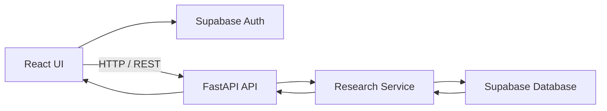

### Main research endpoint

```text
/api/research
```

The frontend sends research requests to the backend, where the research pipeline is orchestrated.

---

# 14. Backend Research Architecture

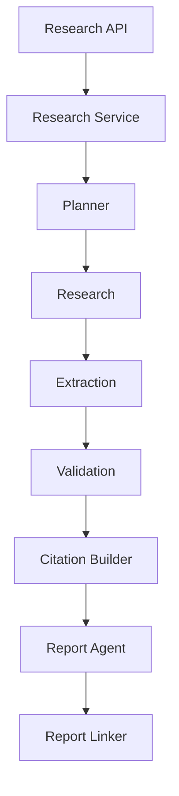

### Architectural principle

The API layer should receive and validate requests, while the **research service/pipeline** handles the multi-stage research process.

---

# 15. Project Folder Architecture

The repository contains separate frontend and backend applications.

```text
mckinsey-ai-market-research-engine/
│
├── backened/
│   ├── main.py
│   ├── requirements.txt
│   ├── routes/
│   ├── services/
│   ├── agents/
│   ├── models/
│   ├── tests/
│   └── ...
│
├── frontened/
│   ├── package.json
│   ├── src/
│   ├── public/
│   ├── components/
│   ├── pages/
│   └── ...
│
├── project-docs/
│   ├── API.md
│   ├── ARCHITECTURE.md
│   ├── DEPLOYMENT.md
│   └── EVALUATION.md
│
├── README.md
└── ...
```

> **Note:** The repository uses the folder names `backened/` and `frontened/`. These names are preserved here to match the project structure.

---

# 16. Backend File Organization

The backend contains the API, research pipeline, models/services, configuration and tests.

A simplified conceptual structure is:

```text
backened/
│
├── main.py
│
├── routes/
│   └── research API
│
├── agents/
│   ├── Planner
│   ├── Research
│   ├── Extraction
│   ├── Validation
│   ├── Citation
│   ├── Report
│   └── Report Linking
│
├── services/
│   └── Research orchestration
│
├── models/
│   └── Request / response / data models
│
├── tests/
│   ├── test_extraction_resilience.py
│   ├── test_gemini_retries.py
│   ├── test_pipeline_resilience.py
│   ├── test_tavily_retries.py
│   └── test_validation_resilience.py
│
└── requirements.txt
```

The exact implementation should be understood from the repository source files; this diagram is an instructor-friendly architectural view.

---

# 17. Database Architecture

The project uses **Supabase PostgreSQL** for persistent application data.

The migration files define tables including:

```text
research_jobs
planner_tasks
sources
evidence
validation_records
memory_records
reports
feedback
```

### Conceptual data model

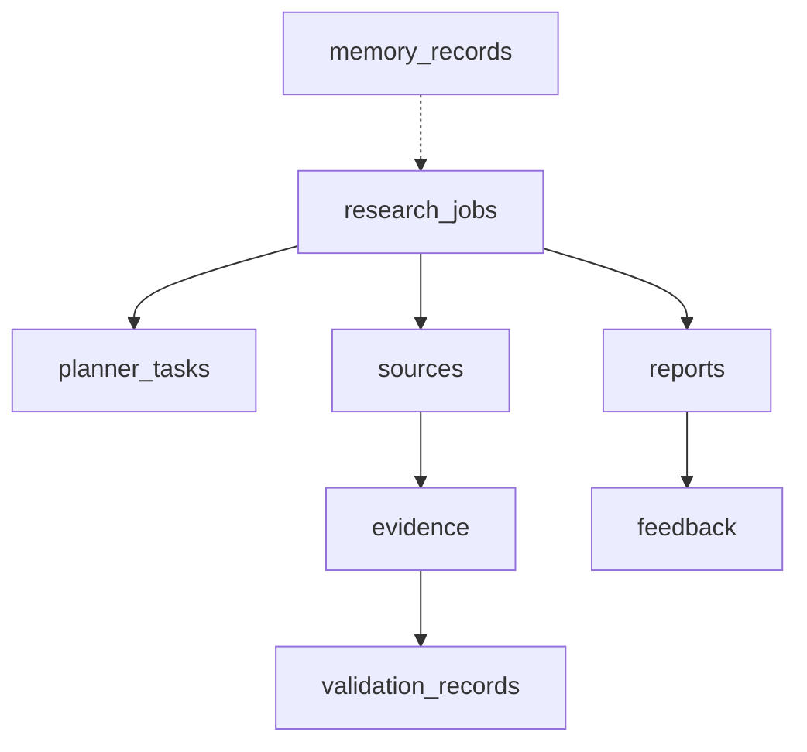

> **Note:** This is a conceptual architecture diagram based on the project’s database objects. It is intended to explain the system to an instructor rather than replace the SQL migration definitions.

---

# 18. Database Responsibilities

| Table / Object | Conceptual Purpose |
|---|---|
| `research_jobs` | Stores research-job information |
| `planner_tasks` | Stores tasks produced by research planning |
| `sources` | Stores source information collected during research |
| `evidence` | Stores extracted research evidence |
| `validation_records` | Stores evidence validation information |
| `memory_records` | Stores project memory-related records |
| `reports` | Stores generated reports |
| `feedback` | Stores feedback information |

---

# 19. Authentication Flow

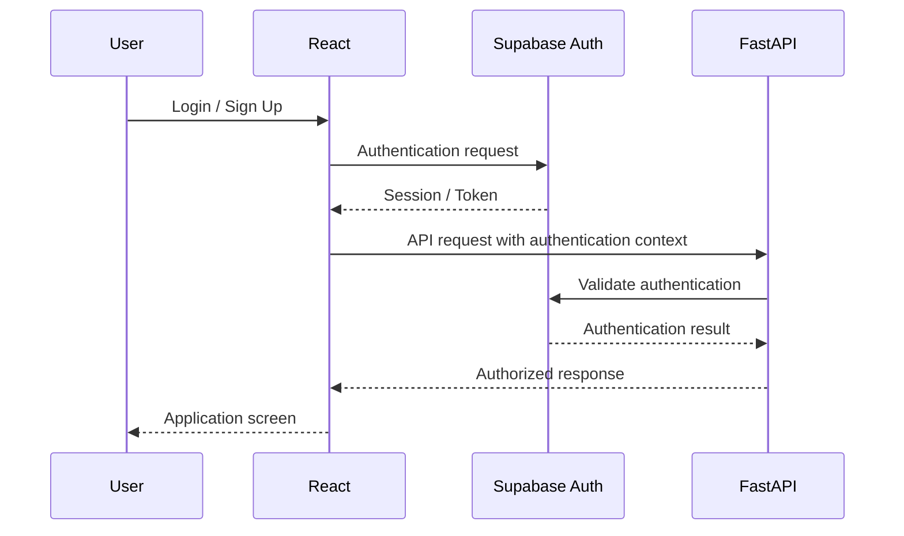

---

# 20. External AI and Search Services

The system depends on two major external services.

## Google Gemini

Used for AI-powered processing within the research pipeline.

Conceptually:

```text
Research Task
     ↓
Gemini
     ↓
AI-generated structured output
```

Relevant pipeline stages include planning, evidence processing/validation support, and report generation.

---

## Tavily

Used for web research and source discovery.

```text
Research Task
     ↓
Tavily Search
     ↓
Web Results
     ↓
Source Collection
```

---

# 21. External Service Resilience

The project includes tests focused on resilience around external services.

Present test files include:

```text
test_gemini_retries.py
test_tavily_retries.py
test_pipeline_resilience.py
test_extraction_resilience.py
test_validation_resilience.py
```

This is important because the research engine depends on external AI and search services.

### Conceptual resilience flow

```text
External Service Request
        ↓
     Success?
      /    \
    YES     NO
     ↓      ↓
 Continue   Retry / Resilience Logic
              ↓
          Continue / Handle Failure
```

---

# 22. API Overview

The main research API is exposed under:

```text
/api/research
```

The FastAPI application also provides standard API documentation endpoints.

### Local API documentation

```text
http://localhost:8000/docs
```

### ReDoc

```text
http://localhost:8000/redoc
```

### Health endpoint

```text
http://localhost:8000/health
```

The exact request/response schema should be taken from the current backend route and Pydantic models.

---

# 23. Environment Variables

## Backend

Create the backend environment configuration with the required values:

```env
GOOGLE_API_KEY=your_google_api_key
TAVILY_API_KEY=your_tavily_api_key
SUPABASE_URL=your_supabase_url
SUPABASE_KEY=your_supabase_key
```

## Frontend

```env
VITE_SUPABASE_URL=your_supabase_url
VITE_SUPABASE_ANON_KEY=your_supabase_anon_key
VITE_API_BASE_URL=http://localhost:8000
```

> Never commit real API keys or private credentials to Git.

---

# 24. Local Setup

## Prerequisites

Install:

- Python
- Node.js / npm
- A Supabase project
- Google Gemini API access
- Tavily API access

---

## Step 1 — Clone the project

```bash
git clone <repository-url>
cd mckinsey-ai-market-research-engine
```

---

## Step 2 — Backend setup

```bash
cd backened
```

Create/activate a Python virtual environment.

### Windows

```bash
python -m venv venv
venv\Scripts\activate
```

### macOS / Linux

```bash
python3 -m venv venv
source venv/bin/activate
```

Install dependencies:

```bash
pip install -r requirements.txt
```

Configure the backend environment variables.

---

## Step 3 — Start backend

From the project environment:

```bash
uvicorn backend.main:app --reload --host 0.0.0.0 --port 8000
```

Backend:

```text
http://localhost:8000
```

API documentation:

```text
http://localhost:8000/docs
```

> Use the repository's actual Python module/path configuration if it differs from the command above in your local environment.

---

## Step 4 — Frontend setup

Open a second terminal:

```bash
cd frontened
```

Install dependencies:

```bash
npm install
```

Configure the frontend environment variables.

Start the development server:

```bash
npm run dev
```

Frontend:

```text
http://localhost:5173
```

---

# 25. Complete Local Architecture

```text
                  LOCAL DEVELOPMENT
                         │
        ┌────────────────┴────────────────┐
        │                                 │
        ▼                                 ▼
┌─────────────────┐               ┌─────────────────┐
│ React Frontend  │               │ FastAPI Backend │
│                 │  HTTP/REST    │                 │
│ localhost:5173  │──────────────▶│ localhost:8000  │
└────────┬────────┘               └────────┬────────┘
         │                                 │
         │                                 │
         ▼                                 ▼
┌─────────────────┐               ┌─────────────────┐
│ Supabase Auth   │               │ Research Engine │
└─────────────────┘               └────────┬────────┘
                                           │
                              ┌────────────┴────────────┐
                              │                         │
                              ▼                         ▼
                       ┌─────────────┐          ┌─────────────┐
                       │   Gemini    │          │   Tavily    │
                       └─────────────┘          └─────────────┘
                              │                         │
                              └────────────┬────────────┘
                                           ▼
                                  ┌─────────────────┐
                                  │ Supabase DB     │
                                  └─────────────────┘
```

---

# 26. Recommended Demo Flow

For an instructor demonstration, use this sequence:

```text
1. Open the application
        ↓
2. Login / authenticate
        ↓
3. Enter a market research question
        ↓
4. Start research
        ↓
5. Explain the Planner
        ↓
6. Explain web research through Tavily
        ↓
7. Explain evidence extraction
        ↓
8. Explain validation
        ↓
9. Explain citation building
        ↓
10. Show generated report
        ↓
11. Show source / evidence traceability
```

---

# 27. Example Instructor Explanation

### Step 1 — User Input

> “First, the user provides a business or market research question through the React frontend.”

### Step 2 — API Request

> “The frontend sends the request to the FastAPI backend.”

### Step 3 — Planning

> “The Planner Agent converts the broad question into structured research tasks.”

### Step 4 — Research

> “The Research Agent uses Tavily to find relevant online sources.”

### Step 5 — Extraction

> “The Extraction Agent processes the collected information and extracts useful evidence.”

### Step 6 — Validation

> “The Validation Agent checks the evidence before it is used in the report.”

### Step 7 — Citations

> “The Citation Builder connects validated evidence with source information.”

### Step 8 — Report Generation

> “The Report Agent uses the validated research to generate a structured strategy report.”

### Step 9 — Traceability

> “Finally, the Report Linker maintains the connection between report findings, evidence, and original sources.”

---

# 28. One-Slide Architecture for Presentation

If you need to put the architecture on a PPT slide, use this:

```text
                    McKINSEY AI MARKET RESEARCH ENGINE

                              USER
                               │
                               ▼
                    ┌──────────────────┐
                    │ React Frontend   │
                    └────────┬─────────┘
                             │
                             ▼
                    ┌──────────────────┐
                    │   FastAPI API    │
                    └────────┬─────────┘
                             │
                             ▼
       ┌─────────────────────────────────────────────┐
       │              7-STAGE PIPELINE               │
       │                                             │
       │ Planner → Research → Extraction → Validation│
       │     → Citation → Report → Report Linker     │
       └──────────────┬───────────────────┬──────────┘
                      │                   │
                      ▼                   ▼
                ┌───────────┐       ┌───────────┐
                │  Gemini   │       │  Tavily   │
                │ AI Engine │       │ Web Search│
                └─────┬─────┘       └─────┬─────┘
                      │                   │
                      └─────────┬─────────┘
                                ▼
                       ┌─────────────────┐
                       │ Supabase        │
                       │ Auth + Database │
                       └────────┬────────┘
                                │
                                ▼
                    REPORT + CITATIONS + SOURCES
```

---

# 29. Architecture Design Principles

## 1. Separation of responsibilities

Each research stage has a focused responsibility.

```text
Planner       → What should we research?
Research      → Where can we find information?
Extraction    → What evidence is useful?
Validation    → Is the evidence usable?
Citation      → How do we reference it?
Report        → How do we synthesize it?
Linker        → Where did each finding come from?
```

---

## 2. Evidence-first reporting

The pipeline places evidence processing before final report generation.

```text
Research
   ↓
Evidence
   ↓
Validation
   ↓
Citation
   ↓
Report
```

This is preferable to simply asking an LLM to generate a report directly from a question.

---

## 3. Traceability

The system preserves a conceptual path:

```text
Question
  ↓
Task
  ↓
Source
  ↓
Evidence
  ↓
Validation
  ↓
Citation
  ↓
Report Finding
```

---

## 4. External service separation

AI reasoning and web research are provided by separate external services.

```text
Gemini → AI processing / generation
Tavily → Web research / search
```

This keeps the research architecture conceptually separated.

---

# 30. Testing

The repository includes tests focused on research-pipeline reliability.

### Current test files

```text
backened/.../test_extraction_resilience.py
backened/.../test_gemini_retries.py
backened/.../test_pipeline_resilience.py
backened/.../test_tavily_retries.py
backened/.../test_validation_resilience.py
```

### Testing focus

```text
Extraction resilience
        +
Gemini retry behavior
        +
Pipeline resilience
        +
Tavily retry behavior
        +
Validation resilience
```

The exact test commands depend on the backend test configuration in the repository.

---

# 31. Documentation Included in the Project

The repository contains additional project documentation:

```text
project-docs/
│
├── API.md
├── ARCHITECTURE.md
├── DEPLOYMENT.md
└── EVALUATION.md
```

These documents can be used alongside this README when explaining the implementation in detail.

---

# 32. Deployment Architecture

The logical production architecture can be represented as:

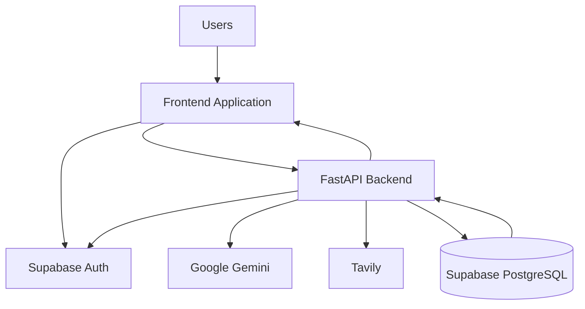

The repository also contains:

```text
project-docs/DEPLOYMENT.md
```

for deployment-specific project documentation.

---

# 33. Security Considerations

The application uses authentication and environment-based credentials.

### Important rules

- Keep API keys in environment variables.
- Do not commit `.env` files containing secrets.
- Do not expose private API keys in frontend source code.
- Use the appropriate Supabase key for the intended client/server context.
- Validate API inputs through backend models.
- Keep authentication checks in the backend/API flow.

---

# 34. Error Handling Concept

The system interacts with external services, so failures can occur.

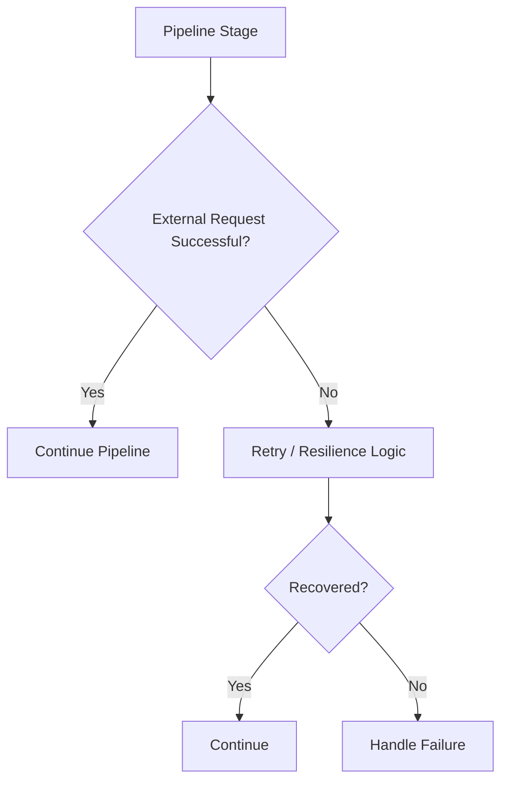

This architecture is supported by the project's resilience-oriented tests.

---

# 35. Strengths of the Architecture

| Strength | Explanation |
|---|---|
| **Modular pipeline** | Research is divided into understandable stages |
| **Evidence validation** | Evidence is processed before report generation |
| **Source traceability** | Reports can be connected to evidence and sources |
| **AI + search separation** | Gemini and Tavily have distinct roles |
| **Full-stack implementation** | React frontend + FastAPI backend + database |
| **Persistent storage** | Research artifacts can be stored in Supabase |
| **Authentication** | User authentication is handled through Supabase |
| **Resilience testing** | External service failures are explicitly considered |
| **API documentation** | FastAPI exposes interactive documentation |
| **Expandable design** | Pipeline stages can be developed independently |

---

# 36. Limitations to Explain Honestly

The README should not imply that AI-generated research is automatically perfect.

Potential limitations include:

- Web sources can change or become unavailable.
- AI extraction and summarization can still require human review.
- Search quality depends on the research query and available sources.
- External Gemini/Tavily services require valid API access.
- The quality of the final report depends on the quality of collected evidence.
- The exact production deployment configuration depends on the project's deployment environment.

A strong project presentation should describe the system as an **evidence-driven research assistant**, not as a replacement for expert judgment.

---

# 37. Future Enhancement Ideas

Possible future improvements include:

```text
┌─────────────────────────────────────────────┐
│             FUTURE EXTENSIONS               │
├─────────────────────────────────────────────┤
│ • More source types                         │
│ • Advanced source ranking                   │
│ • Better evidence confidence scoring        │
│ • Human review / approval checkpoints        │
│ • Export to PDF / PowerPoint                │
│ • Advanced report templates                 │
│ • Research history comparison               │
│ • More detailed analytics                   │
│ • Background / queued research jobs         │
│ • Additional LLM providers                  │
└─────────────────────────────────────────────┘
```

These are **future ideas**, not claims about functionality already implemented in the repository.

---

# 38. Quick Reference

## Frontend

```text
Technology: React 19 + Vite
Local URL: http://localhost:5173
Start: npm run dev
```

## Backend

```text
Technology: FastAPI + Python
Local URL: http://localhost:8000
Start: uvicorn backend.main:app --reload --host 0.0.0.0 --port 8000
```

## API

```text
Research: /api/research
Docs:     /docs
ReDoc:    /redoc
Health:   /health
```

## AI

```text
Google Gemini
```

## Search

```text
Tavily
```

## Database / Auth

```text
Supabase
```

---

# 39. Final Architecture Summary

```text
                         ┌────────────────────┐
                         │       USER         │
                         └─────────┬──────────┘
                                   │
                                   ▼
                         ┌────────────────────┐
                         │   REACT FRONTEND   │
                         └─────────┬──────────┘
                                   │
                                   ▼
                         ┌────────────────────┐
                         │    FASTAPI API     │
                         └─────────┬──────────┘
                                   │
                                   ▼
                  ┌─────────────────────────────────┐
                  │       RESEARCH PIPELINE         │
                  │                                 │
                  │  1. Planner                     │
                  │  2. Research                    │
                  │  3. Extraction                  │
                  │  4. Validation                  │
                  │  5. Citation Builder            │
                  │  6. Report Agent                │
                  │  7. Report Linker               │
                  └──────────────┬──────────────────┘
                                 │
                  ┌──────────────┴──────────────┐
                  │                             │
                  ▼                             ▼
          ┌──────────────┐              ┌──────────────┐
          │ Google Gemini│              │    Tavily    │
          │ AI Processing│              │ Web Research │
          └──────┬───────┘              └──────┬───────┘
                 │                             │
                 └──────────────┬──────────────┘
                                ▼
                       ┌──────────────────┐
                       │     SUPABASE     │
                       │ Auth + PostgreSQL│
                       └────────┬─────────┘
                                │
                                ▼
                ┌──────────────────────────────┐
                │ FINAL STRATEGY REPORT        │
                │ + CITATIONS                  │
                │ + EVIDENCE                   │
                │ + SOURCE TRACEABILITY        │
                └──────────────────────────────┘
```

---

# 40. Project Explanation in One Sentence

> **The McKinsey AI Market Research Engine is a full-stack, evidence-driven AI research system that uses React, FastAPI, Gemini, Tavily, and Supabase to transform a business question into a structured, validated, citation-backed strategy report with source traceability.**

---

# 41. Team & Contribution Breakdown

**Author:** **Shaikh Anila**

### Detailed Role & Contribution Breakdown

- **Frontend & UX/UI (React/Next.js) — Shivam Tyagi**
  - Designed the user experience, executive dashboard layout, interactive citation popover components, and responsive workflow screens.

- **Authentication & API Communication — Shaikh Anila**
  - Implemented Supabase JWT authentication flow, token management, secure HTTP headers, and API client orchestration.

- **Backend & API Layer — Mayuri Laddha**
  - Engineered FastAPI REST endpoints, request/response Pydantic models, routing controllers, and system exception handling.

- **AI Agents 1–3: Planning, Research & Extraction**
  - **Planning (Agent 1): Shivam Tyagi** — Business brief decomposition into focused research sub-tasks.
  - **Research & Extraction (Agents 2–3): Shaikh Anila** — Live Tavily web scraping, domain classification, URL deduplication, and verbatim evidence extraction.

- **AI Agents 4–5: Validation & Citation — Archana Singh (Support: Mayuri Laddha)**
  - Fact-checking claims against source excerpts, scoring credibility and recency, flagging conflicts, and building canonical citation indices.

- **AI Agents 6–7: Report & Linker — Jignesh**
  - Synthesizing verified evidence into structured McKinsey-style briefing reports and programmatically linking claim citations to primary web sources.

- **Database & Persistence — Swapnil**
  - Relational database tables (research_jobs, sources, evidence, validations, reports), repository data access layer, transactional integrity, and closing persistence statements.

---

# 42. Project Status

This README is designed as the **instructor-facing architecture and project guide** for the existing repository.

It emphasizes:

- What the project does
- How the system is structured
- How a research request flows through the application
- What each of the seven AI stages does
- How Gemini and Tavily are used
- How Supabase fits into authentication and persistence
- How evidence becomes citations and report findings
- How the frontend and backend communicate
- How to run the project locally
- How to explain the project during a demonstration

---

## ⭐ If you are presenting this project

Remember this simple sequence:

```text
QUESTION
   ↓
PLAN
   ↓
SEARCH
   ↓
EXTRACT
   ↓
VALIDATE
   ↓
CITE
   ↓
REPORT
   ↓
LINK BACK TO SOURCES
```

**That is the core architecture of the McKinsey AI Market Research Engine.**
